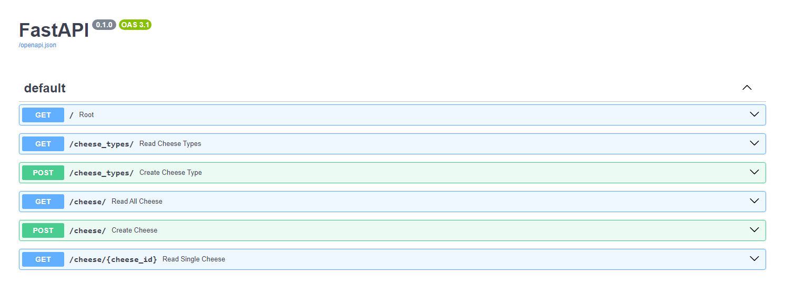

# FastAPITESTProject
Test project for learning basic CRUD fastAPI

The project implements basic database-based endpoints for reproducing lists of Cheese and their types

## Description:
Endpoints:
1. Create Cheese Type endpoint
2. List all possible Cheese Types endpoint
3. Create Cheese endpoint
4. List all Cheese endpoint (with filter by packing type & by cheese type)
5. Detail Cheese endpoint

Stack:
1. FastAPI (Web framework)
2. SQLAlchemy (ORM)
3. Pydantic (Validation, Serialization)
4. Alembic (Migrations handling)

## How to run:
1. `pip install -r requirements.txt`
2. `alembic upgrade head`
3. `uvicorn main:app --reload`
